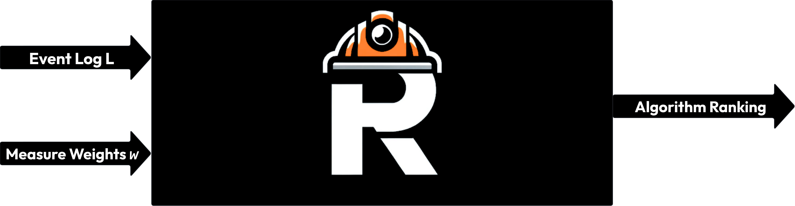
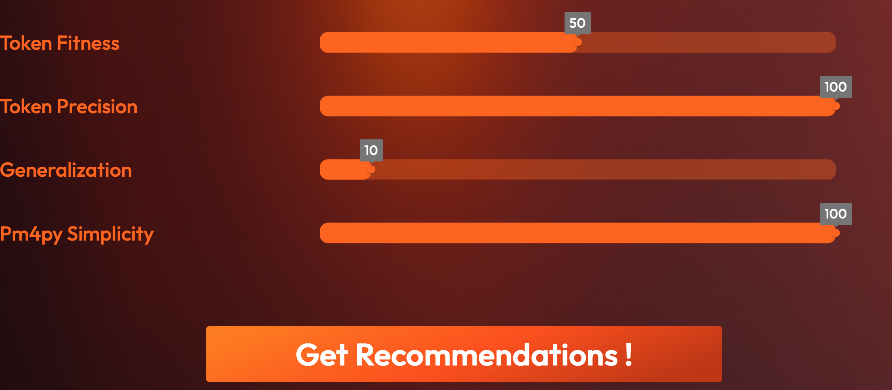
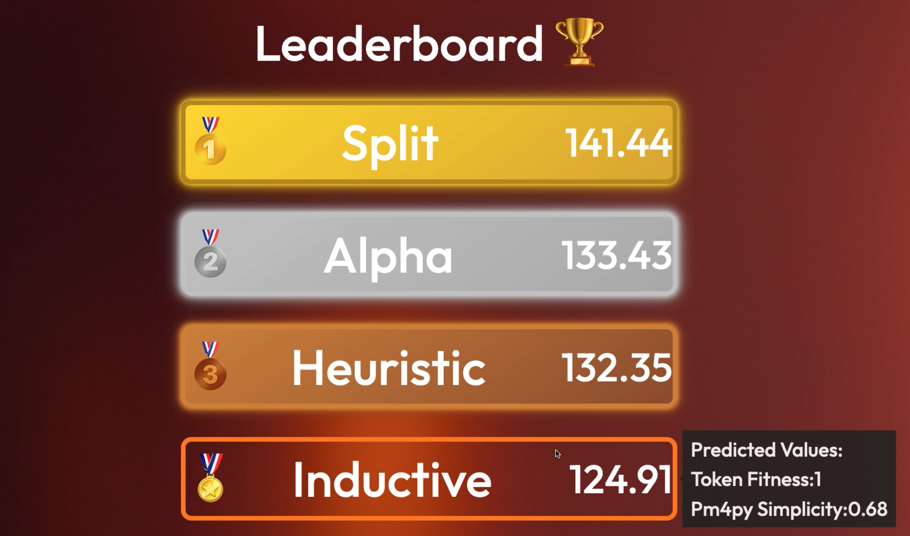
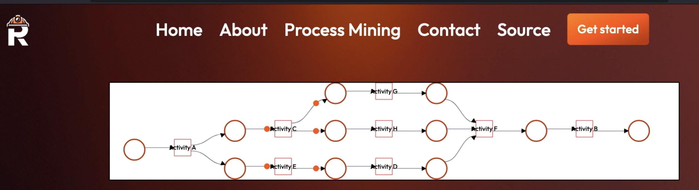
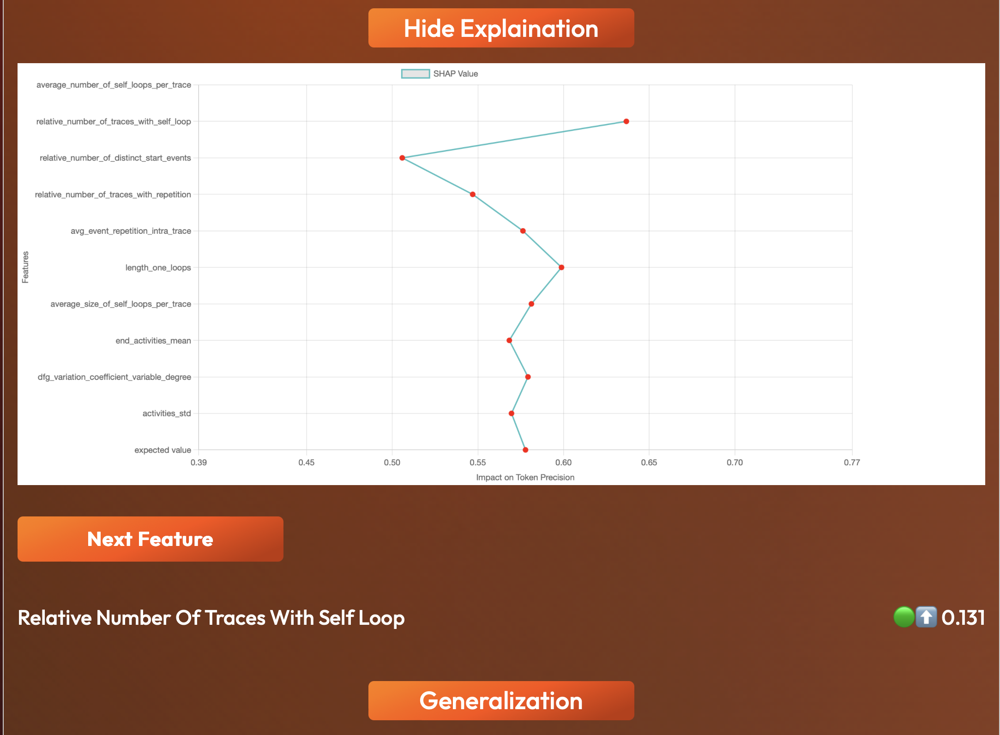

# RecommenderSystem
 

ProReco is a recommender system for process discovery algorithms. Given an event log and weights for fitness, precision, simplicity and generalization, ProReco predicts the discovery algorithm that best maximizes the input.



Additional features include mining the process models in an interactive petri net viewer that simulates the Petri net.

There is also an explaination feature that allows users to get explainations for the predictions using shap plots.

Additional Sources:  
Thesis Presentation Video: https://www.youtube.com/watch?v=mZ8ybOofWNk&feature=youtu.be  
Thesis: [coming soon]   
Paper: [coming soon]  
# INSTALLATION
```cd backend```  
```conda env create -f environment.yml```  
```cd ../frontend/proreco```  
```npm install```  
# Features: